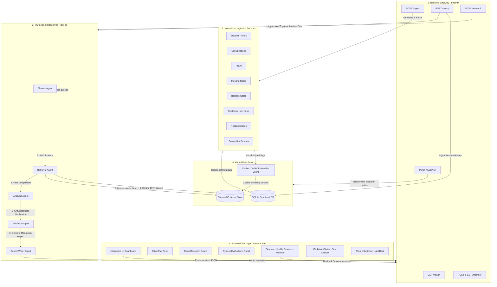

# ARCHITECTURE.md
### System Design — Autonomous Product Intelligence & Decision Support System

> This is a proposed starting architecture. Sections marked **[CONFIRM]** depend on answers from `CLARIFICATION_QUESTIONS.md` and must be finalized in `DECISIONS.md` before implementation.

## 1. High-Level Layers

## 2. Component Responsibilities

### 2.1 Ingestion Pipeline
- Source-specific connectors/parsers normalize each document type into a common schema: `{id, source_type, title, body, author, created_at, tags, related_ids}`.
- Chunking strategy: semantic/paragraph-based chunking with overlap, metadata retained per chunk.
- Embedding + storage into vector DB; structured fields (dates, ticket status, product area) also stored in a relational DB for filterable/aggregatable queries (important for "most common," "which remain unresolved," etc. — these are partly analytical/SQL-shaped questions, not pure semantic search).

### 2.2 Retrieval Layer (Advanced RAG)
- Hybrid retrieval: vector similarity + metadata filters + keyword/BM25 fallback.
- Cross-document linking: related tickets/issues/PRDs are linked via shared entities (feature names, product areas) to support "connect information across sources."
- Re-ranking step before passing context to agents.
- Every retrieved chunk carries its source citation forward through the pipeline.

### 2.3 Agent/Orchestration Layer
- **Planner Agent**: decomposes a business question into sub-tasks (e.g., "identify complaint clusters" → "check resolution status" → "rank by customer impact").
- **Retrieval Agent**: executes retrieval sub-tasks against the RAG layer.
- **Analysis Agent**: aggregates/reasons over retrieved evidence (trend detection, counting, correlation).
- **Validation Agent**: checks claims against source evidence before they reach the report (reduces hallucination risk).
- **Report-Writer Agent**: produces the final structured, cited output (executive summary, ranked list, etc.).
- Deep Research mode chains these agents iteratively (multi-pass) rather than single-pass Q&A.

### 2.4 Long-Term Memory
- Persists across sessions: prior questions asked, key findings/insights discovered, and (optionally) user/team preferences.
- Implementation candidates: dedicated memory table/namespace in vector DB, or a separate lightweight memory store (e.g., key-value + embeddings). **[CONFIRM in Gate 0]**

### 2.5 Evaluation & Observability
- Structured logging of every agent step (input, tool calls, output) for traceability/debugging.
- A minimal eval harness: a fixed set of test questions (from `PRD.md` §5) with expected evidence sources, scored for retrieval precision/recall and answer groundedness.
- Tracing across the multi-agent pipeline (even a simple correlation-ID-based log trace is acceptable for v1).

## 3. API Contract (Draft — finalize in Phase 1)

| Endpoint | Method | Purpose |
|---|---|---|
| `/ingest` | POST | Ingest a document/source batch |
| `/query` | POST | Ask a direct business question, get an evidence-backed answer |
| `/research` | POST | Kick off a deep-research multi-step task, returns a report |
| `/reports/{id}` | GET | Retrieve a generated report |
| `/memory` | GET/POST | Inspect/update long-term memory entries |
| `/evals/run` | POST | Run the evaluation suite against current index |
| `/health` | GET | Service health check |

All endpoints must be documented via OpenAPI/Swagger and testable via curl before frontend work begins (see `AGENT.md` Gate 1).

## 4. Tech Stack (Confirmed for v1)

- **Backend**: Python + FastAPI
- **Vector DB**: Chroma (embedded/file-based, local-first)
- **Relational/metadata DB**: SQLite for structured fields and aggregate queries
- **LLM**: Claude (Anthropic API)
- **Orchestration**: custom lightweight orchestrator
- **Frontend (Phase 4 only)**: React + Vite
- **Deployment**: local Docker first; live deployment target is Render/Fly.io for the backend and Vercel for the frontend if the timeline allows

> Scaling path: if the dataset grows beyond prototype scale, the architecture can migrate from Chroma/SQLite to pgvector/Postgres without changing the core API and retrieval contract.

## 5. Scalability Notes (documented, not necessarily built out for v1)

- Ingestion pipeline should be idempotent and batchable to support horizontal scaling later.
- Vector DB choice should support a migration path to a managed/distributed service if data volume grows past prototype scale.
- Agent orchestration should be stateless per-request where possible, with memory/state externalized to the memory store — enables horizontal scaling of the API layer.

## 6. Open Design Questions

Tracked and resolved in `CLARIFICATION_QUESTIONS.md` / `DECISIONS.md`. This document must be updated whenever a **[CONFIRM]** item is finalized.
