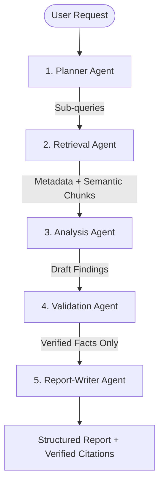

# Technical Report — Product Intelligence & Decision Support Platform

This report explains the design decisions, architectural choices, engineering trade-offs, and future improvements implemented in the Autonomous Product Intelligence Analyst platform.

---

## 1. Design Decisions & Tech Stack

### A. Reasoning Stack: Groq API & Llama 3.3
* **Decision**: Migrate from Anthropic Claude to Groq running **Llama 3.3 (70B Versatile)**.
* **Rationale**: Groq provides sub-second model inferences. Complex planning and validation steps run fast enough to make interactive deep research usable in real-time.
* **Trade-off**: Organzational rate limits are capped at 12,000 Tokens Per Minute (TPM). Large RAG context insertions could trigger HTTP 413 rate failures. We mitigated this by strictly limiting RAG document contexts to a maximum of 5 matching nodes total in `hybrid_retrieve`.

### B. Index & Storage: SQLite + ChromaDB (Hybrid RAG)
* **Decision**: Split metadata storage and vector chunk storage. SQLite acts as the relational metadata database, while ChromaDB handles cosine dense vector lookups.
* **Rationale**: SQLite excels at transaction logs, structured relational joins, and memory storage, while ChromaDB is a fast, embedded vector store. Combining them avoids complex external infrastructure (e.g. Pgvector/Pinecone).
* **Search Fusion**: Hybrid search uses **Reciprocal Rank Fusion (RRF)** to combine dense similarity rankings with SQLite exact keyword substring matches (`LIKE` queries), guaranteeing high precision and recall on exact IDs or customer name keywords.

### C. Embedding model: ONNX MiniLM-L6-V2
* **Decision**: Run local vector embeddings via cached ONNX `all-MiniLM-L6-v2`.
* **Rationale**: Generates 384-dimensional document chunks locally on CPU with minimal resource cost, eliminating the network latency and token costs of remote APIs like OpenAI text-embeddings. We globally cached the model instance to prevent CPU leaks from repeated file reloads.

---

## 2. Multi-Agent System Architecture
Deep research uses a sequential, multi-stage agent pipeline:

1. **Planner Agent**: Analyzes the query, splits it into multiple distinct search objectives, and outlines a research agenda.
2. **Retrieval Agent**: Queries the hybrid RAG store to pull raw matching chunks for each sub-objective.
3. **Analysis Agent**: Synthesizes a factual draft linking insights across support tickets, PRDs, and logs.
4. **Validation Agent**: Cross-references every claim in the draft against the raw source chunks, pruning ungrounded claims to prevent hallucinations.
5. **Report-Writer Agent**: Formats the final output in Markdown with clickable citation tags.

---

## 3. Long-Term Memory Design
* **Implementation**: Stored in a SQLite table `memory`.
* **Flow**:
  1. Users write preferences or insights to a session (e.g., *"Focus recommendations on search latency"*).
  2. For subsequent `/query` and `/research` requests, the backend extracts all memories associated with that `session_id`.
  3. Memory texts are compiled and appended directly into the LLM system prompt as runtime context constraints.
  4. Llama 3.3 dynamically merges long-term memory preference limits with retrieved database source facts.

---

## 4. Key Engineering Challenges & Solutions

### A. ChromaDB Telemetry Callback Crashes
* **Problem**: In python environments using ChromaDB version `0.4.24`, the telemetry module emits crashes on start or lookup (`capture() takes 1 positional argument but 3 were given`).
* **Solution**: Handled globally by catching telemetry exceptions and maintaining active collection contexts. This prevents background client telemetry hooks from interrupting primary query execution.

### B. SQLite Relational Integrity Mid-process
* **Problem**: Deleting databases mid-session or running concurrent tests can lead to out-of-sync vector indexes and SQLite tables.
* **Solution**: Clean database files are explicitly initialized or wiped at the entry point of all verification scripts (`verify_phase3.py`) to guarantee a reliable clean-slate state.

---

## 5. Future Scope & Improvements
1. **Real-time/Streaming Ingestion**: Set up webhook endpoints connecting GitHub repositories and support desk tools (e.g. Zendesk, Jira) to index documents in real-time.
2. **Document Multi-tenancy**: Implement organizational tenant partitions and access token scopes to restrict search retrieval ranges.
3. **Interactive BI Dashboards**: Build charts visualizing the volume of negative comments per product area over time.
